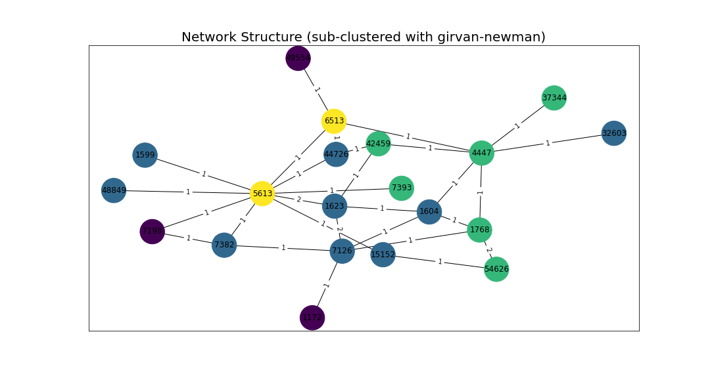

# Causal Analysis in Large Graph Networks

This project focuses on performing causal analysis in a large-scale graph network. The analysis covers connected component distributions, overall network structures, and causal relationships within subclusters. Various clustering algorithms such as Louvain and Girvan-Newmann have been applied to identify meaningful subclusters, followed by causal analysis on graph characteristics.

## Visualizations

### 1. Connected Component Size Distribution

This plot shows the connected component size distribution vs # of nodes/edges in log scale.

### 2. Network Structure Analysis
- **Overall Network Structure**  
  
- **Louvain Subclustering**  
  
- **Girvan-Newman Subclustering**  
  

### 3. Causal Analysis in Subclusters
These plots represent causal relations between different graph characteristics (e.g., in-degree, out-degree, clustering coefficients, betweenness centrality) and interaction metrics (like, dislike, reply, repost count, polarity score) within various subclusters.

- **Subcluster 0**  
  
- **Subcluster 1**  
  
- **Subcluster 2**  
  
- **Subcluster 3**  
  
- **Subcluster 4**  
  

## Summary
This project demonstrates how causal analysis techniques can be applied to large graph networks to uncover relationships between different graph characteristics and user interactions within subclusters. Various clustering methods are employed to explore the structure of the network, providing insights into the underlying causal relationships.
